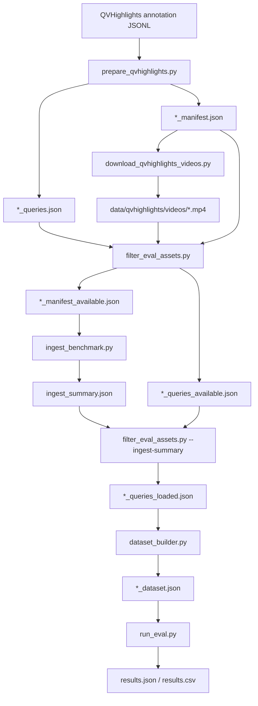

# Retrieval Evaluation

このディレクトリには、`video-rag-tidb-cli` の検索方式を同じ条件で比較するための評価用スクリプトを置いています。

## 目的

今回見たいのは、次の3方式の retrieval quality です。

- `keyword`
- `vector`
- `hybrid`

生成品質ではなく、あくまで「正解セグメントを上位に返せるか」を比較します。

## 前提

- 既存の `video_rag_cli.py` で動画をセグメント化できる
- `init-tidb` と `load-tidb` で TiDB Cloud に投入できる
- 検索は `search-tidb` と同じ実装を再利用する
- TiDB 接続情報は `.env` に入っている

必要な環境変数:

- `TIDB_HOST`
- `TIDB_PORT`
- `TIDB_USER`
- `TIDB_PASSWORD`
- `TIDB_DATABASE`
- `GEMINI_API_KEY` (`vector` / `hybrid` の実行時)

## ファイル

- `ingest_benchmark.py`: ベンチマーク動画を既存パイプラインで index / load する
- `download_qvhighlights_videos.py`: QVHighlights の動画 manifest から YouTube 区間を保存する
- `filter_eval_assets.py`: 手元にある動画と取り込み済み動画に合わせて manifest / query を絞る
- `prepare_qvhighlights.py`: QVHighlights の annotation を評価用 JSON に変換する
- `dataset_builder.py`: GT 時間区間を `relevant_ids` に変換する
- `metrics.py`: Hit Rate / MRR / nDCG
- `run_eval.py`: 3方式を実行して結果を JSON / CSV に保存する

## スクリプトの流れ

どのスクリプトが何を入力して何を出すかを先に書くと、今回の流れは次のようになります。



今回出てくるファイル名の意味はこうです。

- `_available`: 手元に実際の動画ファイルが存在するものだけに絞った manifest / query
- `_loaded`: そのうち、`ingest_benchmark.py` で実際に取り込みまで成功した動画に対応する query

## 1. QVHighlights の annotation を整形する

QVHighlights を使う場合は、まず公式 annotation をこのリポジトリの評価形式に変換します。

実行例:

```bash
.venv/bin/python eval/prepare_qvhighlights.py \
  --annotations data/qvhighlights/annotations/qvhighlights_val.jsonl \
  --output-queries eval/qvhighlights_val_queries.json \
  --output-manifest eval/qvhighlights_val_manifest.json \
  --videos-dir data/qvhighlights/videos \
  --split-name val \
  --limit-queries 50 \
  --max-videos 20
```

このスクリプトは次の2つを作ります。

- 評価用クエリ JSON
- `ingest_benchmark.py` 用の動画 manifest

`ground_truth_windows` には、1クエリに複数ある正解区間をそのまま保持します。

必要なら、この manifest を使って動画区間も落とせます。

```bash
.venv/bin/python eval/download_qvhighlights_videos.py \
  --manifest eval/qvhighlights_val_manifest.json \
  --output-dir data/qvhighlights/videos
```

動画を取得したあと、実際に手元にある動画に合わせて `_available` を作るには次のスクリプトを使います。

```bash
.venv/bin/python eval/filter_eval_assets.py \
  --manifest eval/qvhighlights_val_manifest.json \
  --queries eval/qvhighlights_val_queries.json \
  --output-manifest-available eval/qvhighlights_val_manifest_available.json \
  --output-queries-available eval/qvhighlights_val_queries_available.json
```

## 2. ベンチマーク動画を投入する

まずは、処理したい動画一覧を JSON か JSONL で用意します。

```json
[
  {
    "video_key": "sample_001",
    "video_path": "/absolute/path/to/sample_001.mp4"
  }
]
```

実行例:

```bash
.venv/bin/python eval/ingest_benchmark.py \
  --manifest eval/benchmark_manifest.json \
  --workdir .work/benchmark \
  --segment-seconds 5 \
  --methods transcript,single_frame,multi_frame,video_clip \
  --provider gemini \
  --output-summary eval/ingest_summary.json
```

TiDB への投入をまだしたくない場合は `--skip-load-tidb` を付けます。

`--output-summary` を付けると、どの動画が実際に取り込みまで進んだかを JSON で残せます。
この summary を使って `_loaded` を作ります。

QVHighlights を置くディレクトリ構成の例:

```text
data/
  qvhighlights/
    annotations/
      qvhighlights_val.jsonl
    videos/
      bP5KfdFJzC4_660.0_810.0.mp4
```

## 3. 評価用データセットを作る

次に、取り込み済み動画に対応するクエリだけを `_loaded` として切り出します。

```bash
.venv/bin/python eval/filter_eval_assets.py \
  --manifest eval/qvhighlights_val_manifest.json \
  --queries eval/qvhighlights_val_queries.json \
  --output-manifest-available eval/qvhighlights_val_manifest_available.json \
  --output-queries-available eval/qvhighlights_val_queries_available.json \
  --ingest-summary eval/ingest_summary.json \
  --output-queries-loaded eval/qvhighlights_val_queries_loaded.json
```

そのうえで、クエリと正解時間区間を持つアノテーションを評価用 dataset に変換します。

```json
[
  {
    "query_id": "q1",
    "query": "人がドアを開ける場面",
    "video_ref": "sample_001.mp4",
    "start_sec": 10.0,
    "end_sec": 15.0
  }
]
```

`video_ref` はデフォルトでは `videos.file_name` に対応させます。`file_path` で合わせたい場合は `--video-ref-column file_path` を使います。

実行例:

```bash
.venv/bin/python eval/dataset_builder.py \
  --benchmark eval/qvhighlights_val_queries_loaded.json \
  --output eval/qvhighlights_loaded_multi_frame_dataset.json \
  --method multi_frame \
  --overlap-mode segment \
  --overlap-threshold 0.3
```

この処理では、GT 区間とセグメント区間の重なり率が閾値以上のものを `relevant_ids` として保存します。複数区間がある場合は、それらに重なるセグメントの和集合を正解とみなします。
`--overlap-mode segment` では「1つのセグメントのうち、どれだけ GT 区間に含まれるか」を基準にします。5 秒セグメントと長めの GT 区間を対応付ける今回の用途では、まずこれをデフォルトにしました。
`relevant_ids` が空になるクエリは除外します。

今回の QVHighlights では、動画ファイル名にある `60.0_210.0` のような値は元動画の切り出し範囲ですが、`video_segments.start_sec / end_sec` はクリップ先頭を 0 秒とした値です。`relevant_windows` も同じくクリップ先頭基準なので、そのまま対応付けて問題ありませんでした。

## 4. 評価を実行する

実行例:

```bash
.venv/bin/python eval/run_eval.py \
  --dataset eval/dataset.json \
  --output-json eval/results.json \
  --output-csv eval/results.csv \
  --top-k 10 \
  --ks 1,3,5,10 \
  --method multi_frame \
  --provider gemini
```

出力:

- コンソールに比較表
- `results.json`
- `results.csv`

keyword 実装を見直す前の旧結果を残したい場合は、出力先ファイル名を変えて保存します。今回の検証では、旧版と新しい単語分割版を別ファイルに分けて比較できるようにしました。

## 指標

- `Hit@k`: 上位 `k` 件に正解が1件でも入ったか
- `MRR`: 最初の正解が何位に出たか
- `nDCG@k`: 上位 `k` 件の順位を考慮した指標

## テスト

```bash
.venv/bin/python -m unittest discover -s eval/tests
```

## メモ

- QVHighlights は `prepare_qvhighlights.py` でそのまま変換できます。
- `dataset_builder.py` は複数の GT 区間を持つクエリも扱えます。
- `run_eval.py` は既存検索ロジックをそのまま呼びます。検索アルゴリズム自体は変えません。
- `vector` と `hybrid` はクエリ embedding を毎回生成するので、クエリ数が多いと API コストがかかります。
